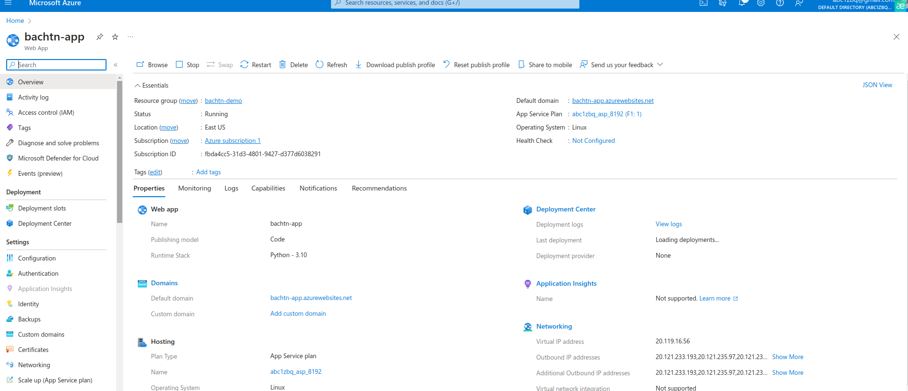
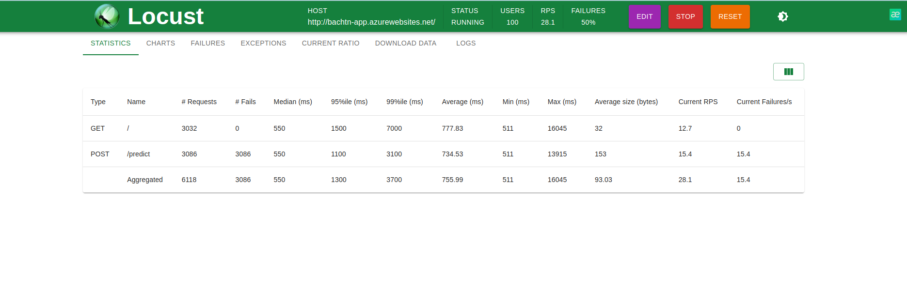

[](https://github.com/tnbach1712/udacity-azure-cicd-exam/actions/workflows/pythonapp.yml)


# udacity-azure-cicd-exam

# Overview

This project utilizes machine learning techniques to predict house prices. The model is built using Python and deployed on the Azure Cloud platform. The goal is to provide accurate and reliable predictions for real estate pricing


## Instructions

 
* Architectural Diagram
  With CICD use Github Action
    

  With CICD use Github Azure pipeline
    


* Instructions for running the Python project.  How could a user with no context run this project without asking you for any help.  Include screenshots with explicit steps to create that work. Be sure to at least include the following screenshots:

  Project running on Azure App Service
    

  Project cloned into Azure Cloud Shell
  

  Passing tests that are displayed after running the `make all` command from the `Makefile`
  

  Output of a test run
  
  Successful deploy of the project in Azure Pipelines.  [Note the official documentation should be referred to and double checked as you setup CI/CD](https://docs.microsoft.com/en-us/azure/devops/pipelines/ecosystems/python-webapp?view=azure-devops).
  

 Running Azure App Service from Azure Pipelines automatic deployment


 Successful prediction from deployed flask app in Azure Cloud Shell.  [Use this file as a template for the deployed prediction](https://github.com/udacity/nd082-Azure-Cloud-DevOps-Starter-Code/blob/master/C2-AgileDevelopmentwithAzure/project/starter_files/flask-sklearn/make_predict_azure_app.sh).
The output should look similar to this:
> 
```bash
udacity@Azure:~$ ./make_predict_azure_app.sh
Port: 443
{"prediction":[20.35373177134412]}
```


  Locust test:
  
  

Output of streamed log files from deployed application:
`
az webapp log tail
`
```
2024-02-07T02:07:13  Welcome, you are now connected to log-streaming service.
Starting Log Tail -n 10 of existing logs ----
/home/LogFiles/__lastCheckTime.txt  (https://bachtn-app.scm.azurewebsites.net/api/vfs/LogFiles/__lastCheckTime.txt)
02/07/2024 01:48:36
/home/LogFiles/kudu/trace/2f551fe5fa0b-c688c07e-3a56-4c3e-94bf-7010afe20e46.txt  (https://bachtn-app.scm.azurewebsites.net/api/vfs/LogFiles/kudu/trace/2f551fe5fa0b-c688c07e-3a56-4c3e-94bf-7010afe20e46.txt)
2024-02-07T01:44:41  Startup Request, url: /api/zipdeploy?isAsync=true, method: POST, type: request, pid: 87,1,14, ScmType: None, SCM_DO_BUILD_DURING_DEPLOYMENT: True
/home/LogFiles/2024_02_07_10-30-0-91_default_docker.log  (https://bachtn-app.scm.azurewebsites.net/api/vfs/LogFiles/2024_02_07_10-30-0-91_default_docker.log)
2024-02-07T01:57:49.274804774Z /tmp/8dc277e98e4259d/antenv/lib/python3.10/site-packages/sklearn/base.py:376: InconsistentVersionWarning: Trying to unpickle estimator LinearRegression from version 1.1.3 when using version 1.4.0. This might lead to breaking code or invalid results. Use at your own risk. For more info please refer to:
2024-02-07T01:57:49.275117980Z https://scikit-learn.org/stable/model_persistence.html#security-maintainability-limitations
2024-02-07T01:57:49.275152484Z   warnings.warn(
2024-02-07T01:57:49.276586403Z [2024-02-07 01:57:49,275] INFO in app: JSON payload: %s json_payload
2024-02-07T01:57:49.459217927Z [2024-02-07 01:57:49,458] INFO in app: inference payload DataFrame: %s inference_payload
2024-02-07T01:57:49.459311532Z [2024-02-07 01:57:49,459] INFO in app: Scaling Payload: %s payload
2024-02-07T01:57:49.478292428Z 169.254.129.1 - - [07/Feb/2024:01:57:49 +0000] "POST /predict HTTP/1.1" 200 35 "-" "curl/7.81.0"

2024-02-07T02:07:07.122162578Z 169.254.129.1 - - [07/Feb/2024:02:07:07 +0000] "GET / HTTP/1.1" 200 32 "-" "python-urllib3/1.26.18"

/home/LogFiles/2024_02_07_10-30-0-91_docker.log  (https://bachtn-app.scm.azurewebsites.net/api/vfs/LogFiles/2024_02_07_10-30-0-91_docker.log)
2024-02-07T01:49:17.782Z INFO  - 7d176fbd3ede Extracting 1KB / 1KB
2024-02-07T01:49:17.782Z INFO  - 7d176fbd3ede Extracting 1KB / 1KB
2024-02-07T01:49:17.782Z INFO  - 7d176fbd3ede Pull complete
2024-02-07T01:49:17.872Z INFO  -  Digest: sha256:6e7907b272357dfda9a8c141b01fc30851ffc4448c6c41b81d6d6d63d2de0472
2024-02-07T01:49:17.883Z INFO  -  Status: Downloaded newer image for 10.1.0.4:13209/appsvc/python:3.10_20230810.1.tuxprod
2024-02-07T01:49:17.897Z INFO  - Pull Image successful, Time taken: 41 Seconds
2024-02-07T01:49:18.256Z INFO  - Starting container for site
2024-02-07T01:49:18.256Z INFO  - docker run -d --expose=8000 --name bachtn-app_0_536b321c -e WEBSITE_USE_DIAGNOSTIC_SERVER=false -e WEBSITE_SITE_NAME=bachtn-app -e WEBSITE_AUTH_ENABLED=False -e WEBSITE_ROLE_INSTANCE_ID=0 -e WEBSITE_HOSTNAME=bachtn-app.azurewebsites.net -e WEBSITE_INSTANCE_ID=cb28b33bdba2c7bbaf59c993cae149b357bc807b61bcb168ca5ba6b0ca5c3e20 -e HTTP_LOGGING_ENABLED=1 appsvc/python:3.10_20230810.1.tuxprod 
2024-02-07T01:49:23.654Z INFO  - Initiating warmup request to container bachtn-app_0_536b321c for site bachtn-app
2024-02-07T01:49:40.360Z INFO  - Container bachtn-app_0_536b321c for site bachtn-app initialized successfully and is ready to serve requests.
/home/LogFiles/AppServiceAppLogs_Feature_Installer/startup_0.log  (https://bachtn-app.scm.azurewebsites.net/api/vfs/LogFiles/AppServiceAppLogs_Feature_Installer/startup_0.log)

2024-02-07 01:49:35,468  [MainThread] [DEBUG] : Initializating AppServiceAppLogging 

2024-02-07 01:49:35,469  [Thread-1 (] [DEBUG] : Did not find any previously bound socket

2024-02-07 01:49:35,469  [MainThread] [DEBUG] : Initialized AppServiceAppLogging
2024-02-07 01:49:40,227  [Thread-3 (] [DEBUG] : Waiting for the logs flag to be set
/home/LogFiles/CodeProfiler/cb28b3_debug.log  (https://bachtn-app.scm.azurewebsites.net/api/vfs/LogFiles/CodeProfiler/cb28b3_debug.log)
[2024_02_07_01_49_40] [appsvc_profiler.installer] [INFO] Code Profiler Installer is starting up
[2024_02_07_01_49_40] [appsvc_profiler.installer] [INFO] Cleaning up any existing status file which indicated signal handlers initialized status
[2024_02_07_01_49_40] [appsvc_profiler.installer] [DEBUG] APPSETTING_WEBSITE_ENABLE_DEFAULT_CODE_PROFILER : None
[2024_02_07_01_49_40] [appsvc_profiler.installer] [INFO] Attempting to install the default code profiler.
[2024_02_07_01_49_40] [appsvc_profiler.installer] [DEBUG] viztracer would save traces to /tmp/cb28b3_profiler_trace.json
[2024_02_07_01_49_40] [appsvc_profiler.installer] [INFO] Successfully installed code profiler.
[2024_02_07_01_49_40] [appsvc_profiler.installer] [INFO] Signal Handlers SIGUSR for needed code-profiler have been initialized for gunicorn process on instance cb28b33bdba2c7bbaf59c993cae149b357bc807b61bcb168ca5ba6b0ca5c3e20
[2024_02_07_01_49_40] [appsvc_profiler.installer] [DEBUG] Code Profiler Installer is exiting as installation is completed
Ending Log Tail of existing logs ---
Starting Live Log Stream ---
2024-02-07T02:07:07.122162578Z 169.254.129.1 - - [07/Feb/2024:02:07:07 +0000] "GET / HTTP/1.1" 200 32 "-" "python-urllib3/1.26.18"
2024-02-07 01:49:35,468  [MainThread] [DEBUG] : Initializating AppServiceAppLogging 
2024-02-07 01:49:35,469  [Thread-1 (] [DEBUG] : Did not find any previously bound socket
2024-02-07 01:49:35,469  [MainThread] [DEBUG] : Initialized AppServiceAppLogging
2024-02-07 01:49:40,227  [Thread-3 (] [DEBUG] : Waiting for the logs flag to be set
[2024_02_07_01_49_40] [appsvc_profiler.installer] [INFO] Code Profiler Installer is starting up
[2024_02_07_01_49_40] [appsvc_profiler.installer] [INFO] Cleaning up any existing status file which indicated signal handlers initialized status
[2024_02_07_01_49_40] [appsvc_profiler.installer] [DEBUG] APPSETTING_WEBSITE_ENABLE_DEFAULT_CODE_PROFILER : None
[2024_02_07_01_49_40] [appsvc_profiler.installer] [INFO] Attempting to install the default code profiler.
[2024_02_07_01_49_40] [appsvc_profiler.installer] [DEBUG] viztracer would save traces to /tmp/cb28b3_profiler_trace.json
[2024_02_07_01_49_40] [appsvc_profiler.installer] [INFO] Successfully installed code profiler.
[2024_02_07_01_49_40] [appsvc_profiler.installer] [INFO] Signal Handlers SIGUSR for needed code-profiler have been initialized for gunicorn process on instance cb28b33bdba2c7bbaf59c993cae149b357bc807b61bcb168ca5ba6b0ca5c3e20
[2024_02_07_01_49_40] [appsvc_profiler.installer] [DEBUG] Code Profiler Installer is exiting as installation is completed

```
## Enhancements

<b>Feature Engineering</b>: Explore additional features that might have an impact on house prices. Consider factors like neighborhood demographics, proximity to amenities, or historical sales data. Feature engineering can enhance the predictive power of your model.

<b>Data Cleaning and Preprocessing</b>: Ensure your dataset is clean and free of missing values or outliers. Apply appropriate data preprocessing techniques such as scaling, normalization, or handling categorical variables. This can improve the accuracy and reliability of your predictions.

<b>Model Selection and Evaluation</b>: Experiment with different machine learning algorithms and evaluate their performance. Consider algorithms like linear regression, decision trees, random forests, or gradient boosting. Use evaluation metrics such as mean squared error (MSE) or R-squared to select the best-performing model.
## Demo 

<TODO: Add link Screencast on YouTube>
https://www.youtube.com/watch?v=88POf_A11Kc

